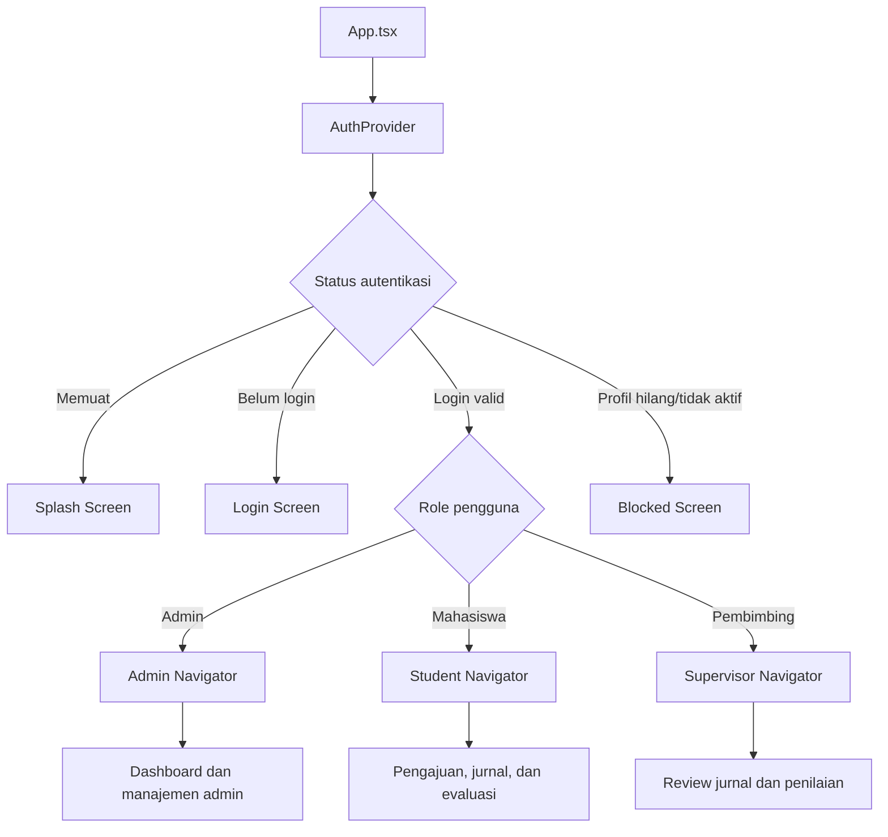
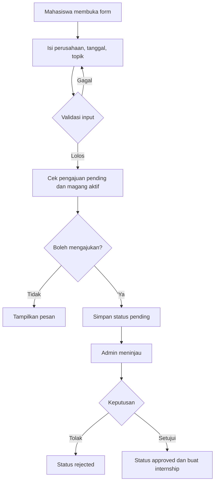
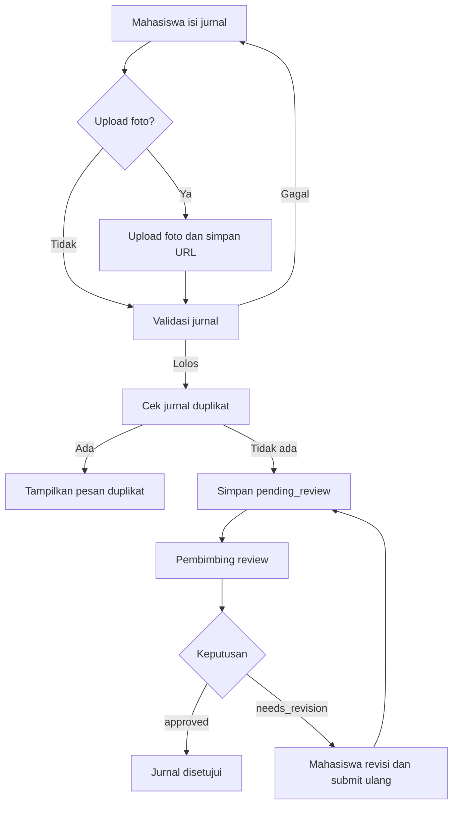
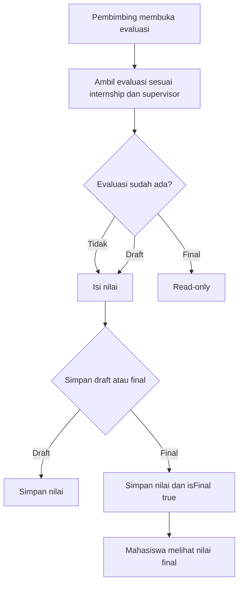

# Flowchart PPNP Internship Tracker

## Alur aplikasi utama

```mermaid
flowchart TD
    A[App.tsx] --> B[AuthProvider]
    B --> C{Status autentikasi}
    C -->|Memuat| D[Splash Screen]
    C -->|Belum login| E[Login Screen]
    C -->|Login valid| F{Role pengguna}
    C -->|Profil hilang/tidak aktif| G[Blocked Screen]
    F -->|Admin| H[Admin Navigator]
    F -->|Mahasiswa| I[Student Navigator]
    F -->|Pembimbing| J[Supervisor Navigator]
    H --> K[Dashboard dan manajemen admin]
    I --> L[Pengajuan, jurnal, dan evaluasi]
    J --> M[Review jurnal dan penilaian]
```

## Alur pengajuan magang

```mermaid
flowchart TD
    A[Mahasiswa membuka form] --> B[Isi perusahaan, tanggal, topik]
    B --> C{Validasi input}
    C -->|Gagal| B
    C -->|Lolos| D[Cek pengajuan pending dan magang aktif]
    D --> E{Boleh mengajukan?}
    E -->|Tidak| F[Tampilkan pesan]
    E -->|Ya| G[Simpan status pending]
    G --> H[Admin meninjau]
    H --> I{Keputusan}
    I -->|Tolak| J[Status rejected]
    I -->|Setujui| K[Status approved dan buat internship]
```

## Alur jurnal harian

```mermaid
flowchart TD
    A[Mahasiswa isi jurnal] --> B{Upload foto?}
    B -->|Ya| C[Upload foto dan simpan URL]
    B -->|Tidak| D[Validasi jurnal]
    C --> D
    D -->|Gagal| A
    D -->|Lolos| E[Cek jurnal duplikat]
    E -->|Ada| F[Tampilkan pesan duplikat]
    E -->|Tidak ada| G[Simpan pending_review]
    G --> H[Pembimbing review]
    H --> I{Keputusan}
    I -->|approved| J[Jurnal disetujui]
    I -->|needs_revision| K[Mahasiswa revisi dan submit ulang]
    K --> G
```

## Alur penilaian

```mermaid
flowchart TD
    A[Pembimbing membuka evaluasi] --> B[Ambil evaluasi sesuai internship dan supervisor]
    B --> C{Evaluasi sudah ada?}
    C -->|Tidak| D[Isi nilai]
    C -->|Draft| D
    C -->|Final| E[Read-only]
    D --> F{Simpan draft atau final}
    F -->|Draft| G[Simpan nilai]
    F -->|Final| H[Simpan nilai dan isFinal true]
    H --> I[Mahasiswa melihat nilai final]
```
